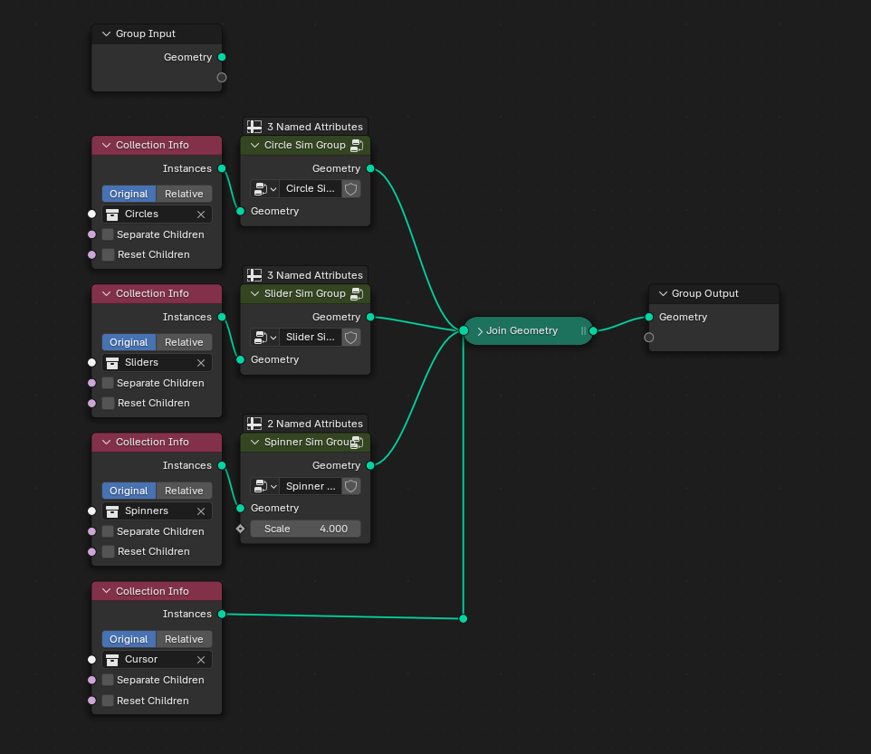
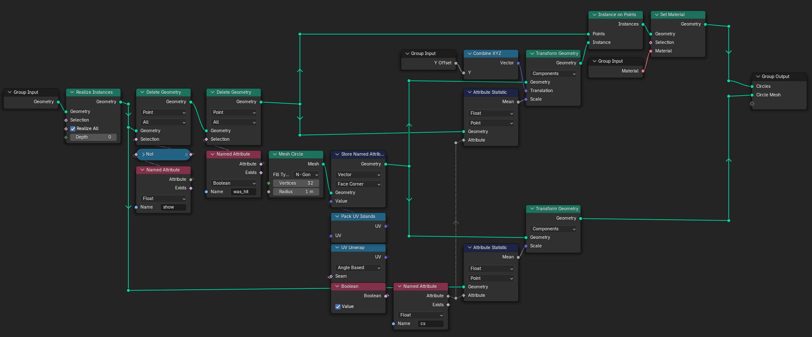
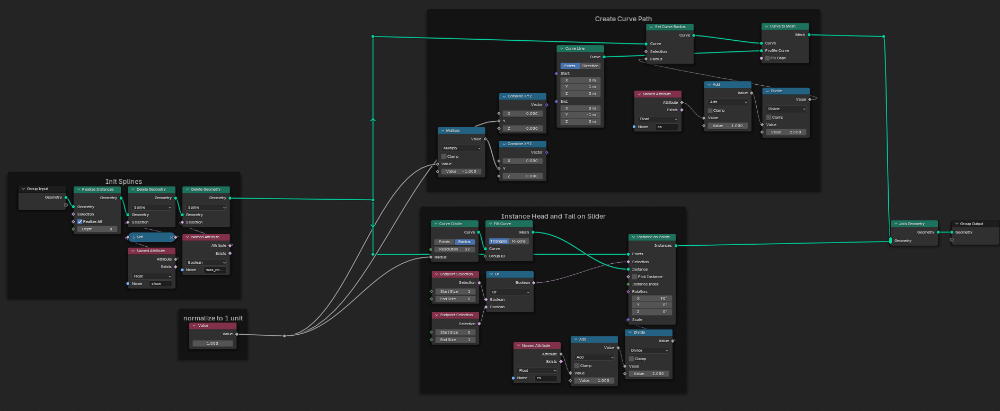
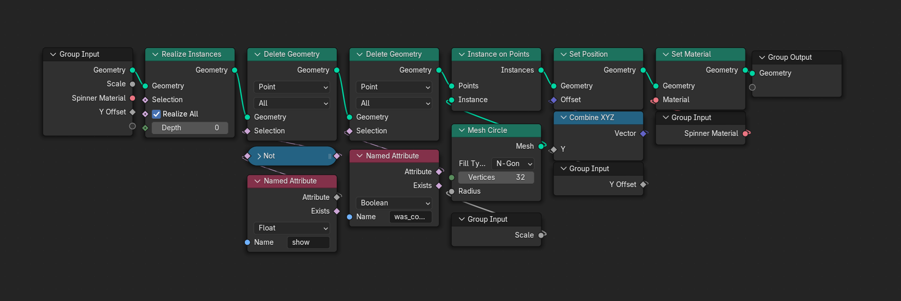

# Blender Importer for osu! Beatmaps and Replays

First and foremost, I don’t know what I’m doing, but I had a goal: importing [`osu!`](https://osu.ppy.sh/) beatmaps and replays into [`Blender`](https://www.blender.org/), ready for Geometry Nodes, so I can create some fancy simulation node setups.

That’s where trusty ol’ ChatGPT came into play. The code is roughly based on 90% of GPT’s work and 10% me banging my head against the wall trying to fix things after GPT broke them.

This addon builds on [`osrparse`](https://github.com/kszlim/osu-replay-parser), which helped with parsing `.osr` files.

**CAUTION: Replays with the intro skipped are broken due to an issue in osrparse's latest versions. osrparse v6.0.2 is currently used**

## Features

### Hitobject Importing
- **Circles**: Fully animated circles with keyframe visibility and hit detection.
- **Sliders**: Supports slider ticks, slider balls, and various spline types (Bezier, Catmull-Rom, etc.).
- **Spinners**: Visualizes spinners with animation and hit detection.

### Replay Data
- **Cursor Movements**: Animates the cursor with replay data, including keypress states (`k1`, `k2`, `m1`, `m2`).

### Geometry Nodes Integration
- Dedicated Geometry Nodes modifiers for:
  - Cursor
  - Circle
  - Slider
  - Spinner
- Attributes like `show`, `was_hit`, `slider_duration_frames`, and more are accessible for custom setups.

### Audio Import
- Imports and synchronizes the beatmap's audio file.
- Adjusts pitch for mods like Double Time (1.5x) and Half Time (0.75x).

### Beatmap and Replay Information
- Displays metadata such as title, artist, difficulty, BPM, total hitobjects, and mods used.

### Flexible Import Options
- Choose between:
  - **Base Import**: Lightweight meshes with Geometry Nodes for customization.
  - **Full Import**: Fully rendered meshes with keyframed visibility. No Geometry Nodes applied.

### Performance Considerations
- Adjustable slider resolution to balance performance and smoothness.
- Deletes imported data and associated resources with a single click.

## Installation

### Step 1: Install the Addon
1. Download the latest `.zip` file from the [Releases](https://github.com/wavezz1/import_osu_addon/releases).
2. In Blender, navigate to `Edit > Preferences > Add-ons`.
3. Click **Install...** and select the downloaded `.zip` file.
4. Enable the addon by checking its box.

### Step 2: Install `osrparse`
1. In the addon preferences, locate the **Install osrparse** button.
2. Click the button to install `osrparse v6.0.2`. If a higher version is installed, it will be replaced.

## Usage

1. Open the **osu! Importer** panel in the sidebar (`N` key).
2. Provide the paths to your `.osu` (beatmap) and `.osr` (replay) files.
3. Configure your import preferences:
   - Select hitobject types (circles, sliders, spinners).
   - Adjust slider options (ticks, balls, resolution).
   - Enable/disable cursor animation and audio import.
4. Click **Import** and enjoy!

## General Geometry Nodes Setup (Blender 4.2)
##### General Overview:

##### Circle Hitobjects:

##### Sliders:

##### Spinners:

[Download Proof of Concept .blend (Blender 4.2)](blendfile/%5Bblender_4.2%5Dosu_in_blender_proof_of_concept.blend)

## Attributes Overview

### General
- `show` (`Boolean`): Visibility state of objects.
- `ar` (`Float`): Approach rate.
- `cs` (`Float`): Circle size.

### Circles
- `was_hit` (`Boolean`): Whether the circle was hit.

### Sliders
- `slider_duration_ms` (`Float`): Duration in milliseconds.
- `slider_duration_frames` (`Float`): Duration in frames.
- `was_completed` (`Boolean`): Whether the slider was fully played.
- `repeat_count` (`Int`): Number of repeats.
- `pixel_length` (`Float`): Length in osu! units.

### Spinners
- `spinner_duration_ms` (`Float`): Duration in milliseconds.
- `spinner_duration_frames` (`Float`): Duration in frames.
- `was_completed` (`Boolean`): Whether the spinner was fully played.

### Cursor
- `k1`, `k2`, `m1`, `m2` (`Boolean`): Key press states.

## Known Issues

1. **osrparse Limitations**: Skipped replay intros may result in broken animations.
2. **Replay Orientation**: Replays may appear flipped on the Z-axis.
3. **Performance**: High slider resolution can impact performance with complex beatmaps.
4. **Slider Ticks**: Slider ticks are not calculated and implemented correctly at the moment.

## Roadmap

### 1.0 Release Goals
The 1.0 release will include all **basic functionalities** required for importing osu! beatmaps and replays into Blender:
- Full support for hitobjects (circles, sliders, spinners, slider balls, approach circles).
- Replay cursor animations.
- Integration of Geometry Nodes for customization.
- Accurate synchronization of audio and replay data.
- Detect flipped maps/cursor.
- Crash fixes.
- Fully optimized import and timeline playback.

### Post-1.0 Features
- **Full Skin Import Support**: Import all visual elements from osu! skins, including custom slider balls, hitcircle overlays, and spinner graphics.

## Support

Feel free to report issues or contribute via the [GitHub repository](https://github.com/wavezz1/import_osu_addon/issues).

## Credits

This addon utilizes [`osrparse`](https://github.com/kszlim/osu-replay-parser) by kszlim and contributors. Blender version 4.2+ is required.

## Ending Words

I only have basic Python knowledge, so please don’t murder me over bad code. Any help to make this work correctly is highly appreciated.

At the end of the day, getting osu! replays and beatmaps into Blender for dynamic 3D replays would be really cool, right?
