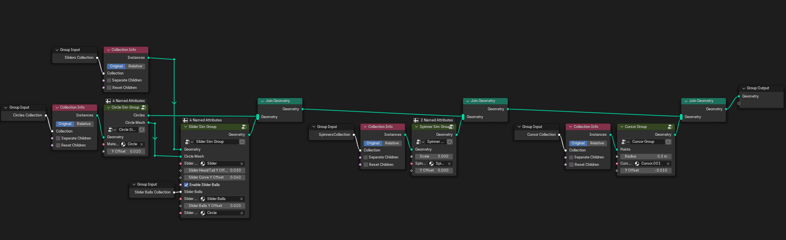

# Blender Importer for osu! Beatmaps and Replays

First and foremost, I don’t know what I’m doing, but I had a goal: importing osu! beatmaps and replays into Blender, ready for Geometry Nodes, so I can create some fancy simulation node setups.

That’s where trusty ol’ ChatGPT came into play. The code is roughly based on 90% of GPT’s work and 10% me banging my head against the wall trying to fix things after GPT broke them.

This addon builds on [`osrparse`](https://github.com/kszlim/osu-replay-parser), which helped with parsing `.osr` files.

**CAUTION: Replays with the intro skipped are broken due to an issue in osrparse's latest versions. osrparse v6.0.2 is currently used**

## What it Does

This addon imports a rough version of both the replay and the beatmap, applying a Geometry Nodes modifier that stores attributes based on drivers referencing offset variables for keyframe timings, etc.

You can then add a separate Geometry Nodes object that, for example, takes all hitobjects and spawns them in a simulation zone according to the "show" attributes.

The Driver system is based on the properties of individual hitobjects, whose values can be keyframed. I wanted to avoid using viewport and render keyframes and instead used a more flexible solution.

## Installation

1. **Download the Addon:**
   - Download the `.zip` file of this addon from the [Releases](https://github.com/wavezz1/import_osu_addon/releases) page.

2. **Install the Addon in Blender:**
   - Open Blender.
   - Go to `Edit` > `Preferences` > `Add-ons`.
   - Click `Install...` at the top-right corner.
   - Select the downloaded `.zip` file.
   - Enable the addon by checking the box next to its name.

3. **Install `osrparse`:**
   - Within the addon, click the "Install osrparse" button if you don't have it installed already. This ensures that the addon can correctly parse `.osr` replay files.

## Blender Proof of Concept v0.6

- [Download the .blend file](blendfile/[blender_4.2]osu_in_blender_proof_of_concept.blend)

1. **Import osu! Beatmaps and Replays:**
   - Use the addon interface to select and import your `.osu` beatmap and `.osr` replay files.

2. **Geometry Nodes Setup:**
   - The addon will create Geometry Nodes modifiers for different hitobject types (`Cursor`, `Circle`, `Slider`, `Spinner`), each storing relevant attributes.

3. **Access the Attributes:**

4. 
   *General Geometry Nodes setup.*

   
   *Geometry Nodes setup for Circle hitobjects.*

   
   *Geometry Nodes setup for Slider hitobjects.*

   
   *Geometry Nodes setup for Spinner hitobjects.*

## Current Features

- **Hitobject Importing:**
  - Supports importing various hitobject types from osu! beatmaps and replays.
  
- **Geometry Nodes Modifiers:**
  - Each hitobject type (`Cursor`, `Circle`, `Slider`, `Spinner`) has a dedicated Geometry Nodes modifier.
  - Attributes are stored and driven by object properties

- **Driver System:**
  - Utilizes Blender's driver system to link Geometry Nodes attributes with hitobject properties.

## Known Issues

- **osrparse Limitations:**
  - Replays with the intro skipped are broken due to an issue in the latest versions of `osrparse`.
  - Currently using `osrparse v6.0.2` to mitigate this issue.
  - Replays are sometimes flipped by 180° on the Z axis.

- **Performance Problems**
  - Geometry Nodes currently get created for every Hitobject. This needs to be improved in coming versions.

## Ending Words 

I only have basic Python knowledge, so please don’t murder me over bad code. Any help to make this work correctly is highly appreciated. Feel free to do whatever you want with the code.

At the end of the day, getting osu! replays and beatmaps into Blender for dynamic 3D replays would be really cool, right?
